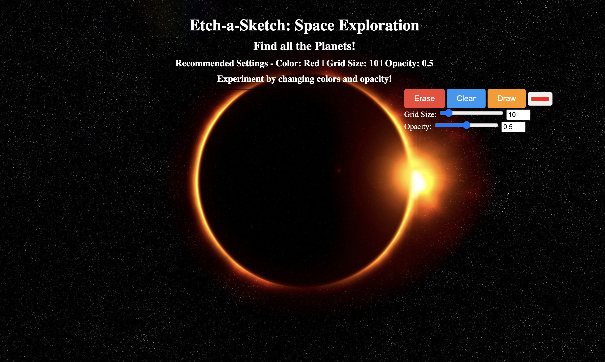
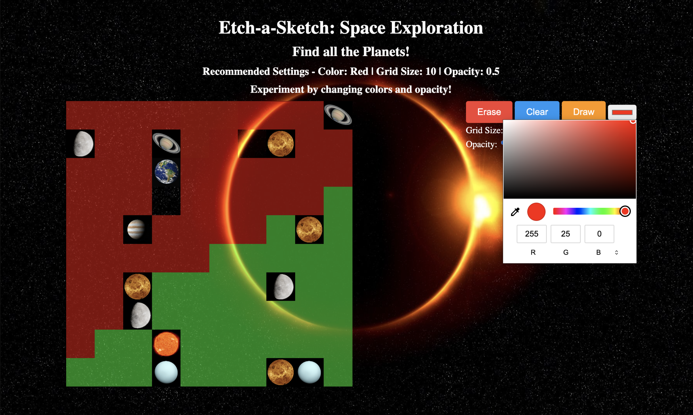

# etchASketch
Welcome to Etch-a-Sketch: Space Exploration! This web application allows you to embark on a space exploration adventure by revealing hidden planets and coloring the grid. Use your cursor to navigate the grid and uncover various celestial bodies such as planets and the sun. Customize the colors and opacity to create stunning space-themed artwork.

With Etch-a-Sketch: Space Exploration, you can unleash your creativity, discover different planets, and enjoy a unique drawing experience. Get ready to explore the cosmos and create beautiful space-themed drawings!

# motivation 

Learn to create and a webpage integrated with JavaScript by creating an interactive 
game for user.

# Build Status

Project Complete

# Code Style

Code Formatting

The code in this project follows a specific code formatting style to maintain consistency and readability. Please adhere to the following guidelines when contributing to the codebase:

Indentation: 

Use 2 spaces for indentation.
Line Length: Limit each line to a maximum of 80 characters to ensure code readability.
Operator Spacing: Add a space between operators and operands to improve code clarity.
To automate the code formatting process, we recommend using ESLint with the JavaScript Standard Style configuration. Before committing any changes, make sure to run ESLint to ensure the code meets the formatting requirements.

Naming Conventions

Consistent and meaningful naming conventions make the code easier to understand. In this project, we follow these naming conventions:

Variables and Functions: 

Use camelCase for variable and function names. 
Choose descriptive names that accurately represent their purpose.
Classes: Use PascalCase for class names to differentiate them from variables and functions.
Constants: Use SCREAMING_SNAKE_CASE for constants, which are typically declared using the const keyword.
By adhering to these naming conventions, we can maintain code consistency and improve code comprehension.

Comments and Documentation

Comments and documentation play a crucial role in understanding the codebase. Here's how we approach comments and documentation in this project:

Inline Comments: 

Use inline comments sparingly and focus on explaining complex or non-obvious code blocks.
Function Documentation: Document functions using JSDoc format. 
Include clear descriptions of parameters, return values, and any important details.
We encourage comprehensive comments and documentation to facilitate code understanding and maintainability.

Best Practices and Design Patterns

To ensure code quality and maintainable architecture, we follow these best practices and design patterns in this project:

DRY (Don't Repeat Yourself): Avoid code duplication and strive for reusable code blocks to minimize redundancy.
SOLID Principles: Adhere to SOLID principles to enhance code maintainability, extensibility, and testability.
MVC Architecture: Our project follows the Model-View-Controller (MVC) pattern to separate concerns and promote a modular code structure.
By following these best practices and design patterns, we aim to create a clean, maintainable, and scalable codebase.

# Screenshots

# Tech/Framework used

- JavaScript
- HTML
- CSS
- Node.js

# Features

1. Revealing hidden planets and the sun as you hover over the grid.
2. Customizable colors using the color picker.
3. Adjustable opacity for creating unique visual effects.
4. Grid size control to accommodate different drawing sizes.
5. Erase button to reset individual squares.
6. Clear button to clear the entire grid.
7. Interactive cursor trail for added visual appeal.

# Code Examples

Example 1: Generating the grid

// Function to generate the grid
function generateGrid(gridSize) {
  // Code for generating the grid
  // ...
}

Example 2: Reveal Planets

// Function to reveal a planet
function handleRevealPlanet(event) {
  // Code for revealing a planet
  // ...
}

Example 3: Handle Color Change

// Function to handle color change
function handleColorChange(event) {
  // Code for handling color change
  // ...
}

Example 4: Clear Button

// Clear Button
clearButton = document.getElementById('clearButton');

clearButton.addEventListener('click', function() {
  // Code for clearing the grid
  // ...
});

# Installation

1. Open Live site: https://adilshads.github.io/etchASketch/  OR follow steps 2-4
2. Clone the repository or download the project files.
3. Pen the index.html file in your preferred web browser.
4. Download node.js 

# API reference

No API References

# Tests

No Tests

# How to Use? 

1. Upon opening the web application, you will see a grid representing space.
2. Move your cursor over the grid to reveal hidden planets and the sun.
3. Customize the drawing experience using the provided buttons and color picker.
4. Adjust the grid size and opacity settings to your preference.
5. Use the Erase button to reset individual squares or the Clear button to clear the entire grid.
6. Let your imagination run wild and create unique space-themed artwork!

# Contribute

# Credits

Image Credit: [WikiImages](https://pixabay.com/users/wikiimages-1897/?utm_source=link-attribution&utm_medium=referral&utm_campaign=image&utm_content=11582)

Image Credit: [TheSpaceway](https://pixabay.com/users/wikiimages-1897/)

Image Credit: [WikiImages](https://pixabay.com/users/wikiimages-1897/)

Image Credit: [WikiImages](https://pixabay.com/users/wikiimages-1897/)

Image Credit: [WikiImages](https://pixabay.com/users/wikiimages-1897/)

Image Credit: [GustavoAckles](https://pixabay.com/users/gustavoackles-6863234/)

Image Credit:[WikiImages](https://pixabay.com/users/wikiimages-1897/)

Image Credit:[WikiImages](https://pixabay.com/users/wikiimages-1897/)

Image Credit:[WikiImages](https://pixabay.com/users/wikiimages-1897/)

Image Credit: [star-mari](https://www.deviantart.com/star-mari)

Image Credit: [A Owen](https://pixabay.com/ru/users/buddy_nath-2005766/)

# License

  